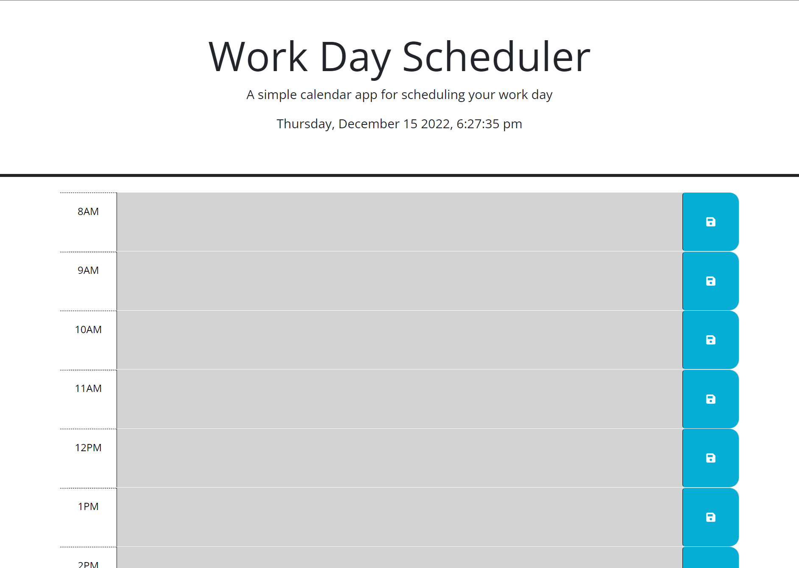

# Day-Scheduler

## Description

I have used JQuery comands and third party APIs to make a day scheduler that responds to the current time and saves user input in the local storage.

## Installation

Not Required. 

## Usage

Type your schedule in for the day and save each component with the button to the left. Past, present, and future hourly slots are colour coded.
Access via: https://lhoole.github.io/day-scheduler/

## Credits
Html & CSS by USYD fullstack Bootcamp

## License

See LICENSE

